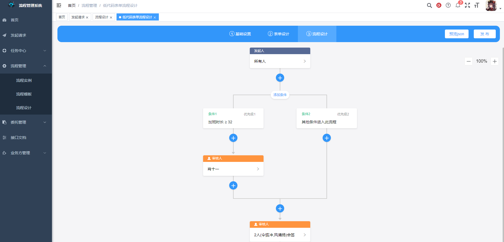

<p align="center" style="margin-bottom: 0 !important">
	
</p>

  **严正声明：现在、未来都不会有商业版本，拒绝伪开源，拒绝加密、加壳、混淆，连网检查授权等行为。**

###### 随手 star ⭐是一种美德。 你们的star就是我们持续开源的动力

我 🐶 在上海艰苦奋斗，白天在国内知名大厂认真搬砖，大多时候晚上加班混个晚餐，夜里和早上为开源做贡献。

### 企业/个人使用登记[登记入口](https://gitee.com/tylerzhou/Antflow/issues/IC07CJ)

# Antflow 简介

AntFlow 是一款基于activiti的、久经生产环境考验的、企业级低代码工作流引擎平台。可独立部署，也可以做为模块嵌入到现有系统中。使用简单，易于维护，前端只需要简单点击和选择即可完成流程配置，后端只需要实现一个接口即可新开发出一条业务流程！

| 项目名               | 地址                                                                                                                                                                                   | 描述                                                                                                                                                                                                                       |
| -------------------- | -------------------------------------------------------------------------------------------------------------------------------------------------------------------------------------- | -------------------------------------------------------------------------------------------------------------------------------------------------------------------------------------------------------------------------- |
| 前端设计器地址       | [⭐Gitee仓库](https://gitee.com/ldhnet/AntFlow-Designer)<br />⭐[GitHub仓库](https://github.com/ldhnet/AntFlow-Designer)<br />⭐[GitCode仓库](https://gitcode.com/ldhnet/FlowDesigner/overview) | 项目独立前端设计器地址,主要用于用户只需要集成设计器,代办,已办等列表都自己设计的自定义程度较高场景,<br />目前项目官网demo上部署的是集成ruoyi的,**和后端项目在一个仓库里,**即后端仓库的**antflow-vue**文件夹下面 |
| 开源Java后端项目地址 | [⭐Gitee仓库](https://gitee.com/tylerzhou/Antflow)<br />[⭐Github仓库](https://github.com/mrtylerzhou/AntFlow)<br />[⭐GitCode仓库](https://gitcode.com/zypqqgc/AntFlow/overview)               | Antflow**后端代码**,其中antflow-vue为官网展示的demo项目,包含了一套去除了后端系统的ruoyi前端                                                                                                                          |
| 开源.net后端项目地址 | ⭐[项目github地址](https://github.com/mrtylerzhou/AntFlow.net)                                                                                                                            | .net 版和java版共用同一套前端,用户可以使用独立设计器,如果需要和官网demo一样的效果,可以下载后端java仓库,然后取出antflow-vue                                                                                                |
| 独立设计器预览地址   | [预览入口](http://14.103.207.27/ant-flow/dist/#/)                                                                                                                                         | 仅独立设计器的预览地址,独立设计器主要用于前端ui定制化需求较高的场景                                                                                                                                                        |
| 成品案例预览地址     | [预览入口](http://14.103.207.27/admin/)                                                                                                                                                   | 即java后端项目里的antflow-vue项目的预览,用于快速和ruoyi集成                                                                                                                                                                |
| 系统操作手册地址     | [查看入口](https://gitee.com/tylerzhou/Antflow/wikis/)                                                                                                                                    |                                                                                                                                                                                                                            |

- QQ技术交流群（972107977） 期待您的加入
- 有疑问可以Issues留言，我们会认真对待  [issues地址](https://gitee.com/tylerzhou/Antflow/issues)

## Antflow核心特性

+ **🥇🥇全网首创虚拟节点(VNode)模式!将流程流转业务和引擎(Flowable/camunda/activiti)执行api高度分离,零流程引擎知识也可上手开发工作流系统!(有经验的开发者更是如鱼得水,游刃有余,简介最后面有专业书籍推荐)**
+ **🦍🦍虚拟节点是activiti/flowable引擎api无关的、可迁移的（目前正在移植其它语言）、更加灵活可控的、安全的流程节点（你是否遇到过因为改activiti/flowable某个属性导致报错无法解决或者即便不报错但是行为不符合预期😭😭）。虚拟节点提供更加灵活的控制和更强大的业务表达能力。从而实现更的特定流程引擎api和流转业务设计解耦.让开发者更加聚焦业务开发**
+ **😄😄超级简单的开发模式。使用适配器模式将流程引擎流转业务和用户表单处理业务完全分离。 DIY流程后端只需要实现一个接口即可快速开发上线！低代码流程更是只需要拖拽即可完成流程设计，简单流程实现零代码！！这一切都如此简单，而且不需要流程引擎知识！不需要流程引擎知识！不需要流程引擎知识！**
+ **👨‍👨‍👦‍👦👨‍👨‍👦‍👦完全接管activiti用户系统(activiti自身用户系统太弱了,而且企业都有自身的用户系统设计),企业可以完全忘掉activiti中的用户表,群组表,成员关系表等等.接入企业现有系统中的用户,角色系统,这一切都非常容易!**
+ **🚩🚩允许运行时定义节点.彻底满足中国式办公特点! 安全实现流程串行、并行、会签、或签，顺序会签、审批人去重、加批、委托、转办、退回任意节点、动态跳过节点、变更处理人，版本迁移，低代码设计等等功能。**
+ **💻💻流程预览图、流程审批路径都是Json数据，而非图片流！一切皆Json！可自定义视觉渲染风格，以适应不同风格的系统。**

> 以上多多次提到不需要流程引擎知识，主要是想强调使用Antflow即便没有专业的流程引擎知识也可以快速上手开发流程。 如果想要二开流程引擎知识仍然是必不可少的。二开指的是更改流程引擎核心源代码从而改变引擎的默认行为以适应企业特殊定制需求。Antflow本身提供了强大的审批人规则、审批条件规则等丰富的定制api，已经能满足95%以上场景，这些叫扩展，不叫二开，也是不需要流程引擎专业知识的

# Antflow核心技术栈

* Java8-21 (master分支为java8版本,如果使用较新java版本,请切换到java17_support分支)
* Activiti（fork了activiti源码，并进行了魔改，⚠⚠用户请使用antflow源码中提供的sql进行建表，不要使用activiti自动创建表功能）
* Spring Boot 2.7.17
* MybatisPlus 3.5.1
* MySql 5.7+

# Antflow架构图


# 项目截图





# 核心特性：

1. **开源,完全免费**,没有任何收费功能,无付费引导。(如果您的企业使用了,麻烦让作者知道,帮助作者推广开源项目,作者也会帮您进行技术支持,帮您在企业快速落地)
2. 引擎遵守高内聚低耦合设计理念,将流程引擎和审批业务完全分离,流程引擎业务不会入侵到业务里,只需要关注业务流转逻辑编写,极大降低入门门槛,**开发超级简单,只需要实现一个接口即可完成一个流程开发**
3. 流程设计简单,流程设计器用户友好，人人可用：AntFlow提供了一个简洁的流程设计器，摒弃了传统设计工具的复杂性，使得用户能够直观、轻松地设计和管理工作流程。
4. 流程引擎和用户角色系统解耦,可以较方便的接入用户系统现有的用户角色系统,**快速集成到现有业务系统中**
5. 流程可调试:AntFlow 提供了一个管理流程调试界面，同样不需要程序员介入，流程管理员便可通过流程调试界面解决大部分日常常见流程问题。把程序员从繁琐的重复的日常小问题排查中解放出来专注于解决更有价值的问题。
6. 引擎完全透明化，流程所有节点、任意属性都是可追溯的，出了问题有据可依,心里有底.
7. 久经生产检验的：AntFlow经历了多个版本的迭代更新.在某大中型客服公司、某中型互联网公司、某大型快递公司落地使用，经受住了复杂业务场景海量数据压力的考验。

# 快速开始

## 前端运行

### Nodejs V16.20.0 及以上版本

```
# gitee克隆项目
git clone https://gitee.com/tylerzhou/Antflow.git 

# 进入项目目录
cd Antflow/antflow-vue

# 安装依赖
npm  install  --registry=https://registry.npmmirror.com

# 启动服务
npm run dev

# 构建测试环境 npm run build:stage
# 构建生产环境 npm run build:prod
# 前端访问地址 http://localhost:80
```

## 后端运行

1. 项目下载 git clone https://gitee.com/tylerzhou/Antflow.git
2. 打开 **antflow-web模块**下resources目录下的**application-dev.properties**文件,修改数据库连接信息,新建一个名为**antflow**的数据库
3. 打开里面**antflow-web**模块resources目录下的scripts文件夹,执行里面的**act_init_db.sql**和**bpm_init_db.sql**
4. 启动项目,如果一切顺利,这时候后端就启动起来了

## 捐赠支持

😀 你可以请作者喝杯咖啡表示鼓励

- 有捐赠的小伙伴（金额不限）可以联系作者领取一份 **独家提升开发技能的文档**
- 加QQ574427343或者邮件到 574427343@qq.com邮箱 *注明 领取开发技能提升文档*

<table>
    <tr>
        <td></td>
        <td></td>
    </tr>  
</table>

## 好书推荐

大家在使用本项目时，推荐结合贺波老师的书
[《深入Flowable流程引擎：核心原理与高阶实战》](https://item.jd.com/14804836.html)学习。这本书得到了Flowable创始人Tijs Rademakers亲笔作序推荐，对系统学习和深入掌握Flowable的用法非常有帮助。

> flowable源于activiti,很多核心表,核心api和设计模式都是一样的.读flowable的书同样也可以用在activiti上


